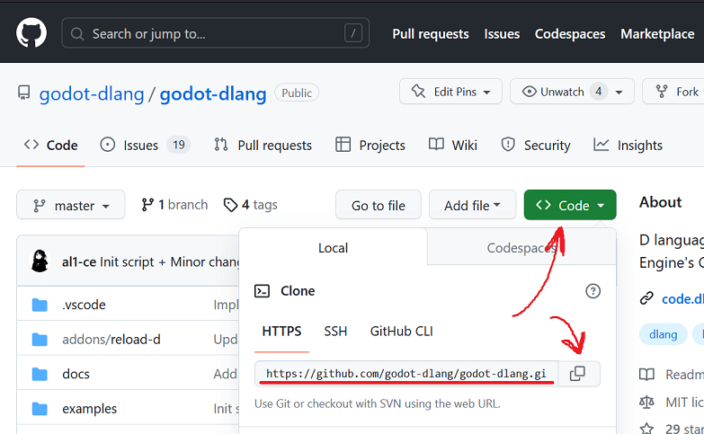

# Getting Started

This section introduces software and tools used in development.
Some of the tools are optional, such tools have extra added value but are not strictly necessary for work. In some situations however they are invaluable.

## Prerequisites

This section lists the basic tools required to both develop your own game extensions and godot-dlang itself. 
For beginners these tools are a requirement, without these tools development is not possible.

Note: DMD is a reference D compiler, it is fast but produces average speed code, LDC2 is another compiler based on LLVM that produces much faster code and is recommended for production builds of your apps but otherwise is optional.

Godot editor:
* Go to the official godot site and download actual Godot4 version for your platform, it includes the editor, but doesn't have debug information which makes it difficult to debug, but for now is ok. Note that currently only 64 bit versions supported.

Windows:
* MS build tools - system libraries and compiler
* TortoiseGit - git GUI for Windows Explorer _(optional)_

Linux:
* gdb, lldb _(optional)_ - debuggers
* gcc - compiler and build tools

Common tools:
* *`git` - version control system

D tools:
* *`dmd` compiler
* *`ldc2` compiler _(optional)_
* *`dub` package manager and build tool _(included with previous two)_

In this guide as an editor we will use `Visual Studio Code`, and our workflow is centered around it.

Recommended Visual Studio Code extension:

* Microsoft C/C++ - debugging support
* code-d - D and dub support
* CodeLLDB - mainly used in pair with LDC compiler on Linux

These are the most basic tools you need to get started developing and debugging godot-dlang.

Make sure you have dub and D compilers available in `PATH` environment variable otherwise the further commands will fail.

Linux D installer script provides handy scripts to enable temporary aliases that you can run with this command `source ~/dlang/ldc-1.32.0/activate` (replace 1.32 with your actual version).

## Let's test it out

Open your terminal and run the following commands to make sure everything is ready.
Here is a list of terminal commands and their respective output. Yhe command has $ symbol appended for ease of reading and is not a part of the actual command.

```sh
$ git --version
git version 2.34.1
```

```sh
$ dub --version
DUB version 1.31.1, built on Mar 12 2023
```

```sh
$ dmd --version
DMD64 D Compiler v2.099.1  
Copyright (C) 1999-2022 by The D Language Foundation, All Rights Reserved written by Walter Bright
```

```sh
$ godot --version
4.0.1.stable.custom_build.cacf49999
```

Your versions might be different but that's ok, also notice that I am using a custom debug build, this way it has full debug information available, more info about this in later chapters.

If any of the commands fails make sure you have your OS `PATH` environment variable have correct path to that programs, on Windows after adding `PATH` entries you need to restart terminal to see the changes.

## git gud with local godot-dlang clone

Ok now go back to the terminal and open up some well known location where you want to place a working copy of godot-dlang bindings repository.

This means we have to remember 3 locations:
* godot executable
* Your godot project folder
* godot-dlang working copy 

Open up godot-dlang github page in a browser and click green button to get HTTPS git clone link.

https://github.com/godot-dlang/godot-dlang



Then run `git clone` command in location where you want to store your local copy of it, for simplicity I will use home folder `/home/username`

```sh
$ cd /home/username
$ git clone https://github.com/godot-dlang/godot-dlang.git
```

git will clone that repository into a subfolder with the name of .git file, `godot-dlang` in this case.

Wait until it finishes and you are ready for the next step.

## Generating bindings

There is one major step required before we can dive into code.
Because GDExtension is designed to enable use of practically any language, it provides only some basic C API's for interoperability, these are changed infrequently so we have pre-made bindings for them, however actual game framework classes can change from version to version and are supposed to be (re)generated with every godot release.

That's what we are going to do now.
First let's generate Godot bindings API.

```sh
$ cd /home/username/godot-dlang
$ godot --dump-extension-api
$ dub run :generator -- -j extension_api.json -o
```

This will tell godot to emit special JSON file with information about engine types and classes, named `extension_api.json`.

Now we need to build D bindings from this information, but first step inside cloned `godot-dlang` folder.

In the end you should see something like this
```
... long process with lots of text ...

Done! API bindings written to '/home/username/godot-dlang/classes'
```

If everything is okay proceed to the next chapter.
